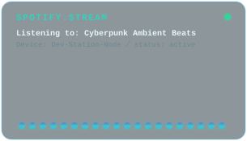

<!-- Generated by GitHub Profile Agent Console. Edit profile.config.json, then run npm run generate. -->

  <picture>
    <source media="(max-width: 760px) and (prefers-color-scheme: dark)" srcset="./assets/hero/agent-console-f2a72471-mobile-dark.svg">
    <source media="(max-width: 760px)" srcset="./assets/hero/agent-console-f2a72471-mobile-light.svg">
    <source media="(prefers-color-scheme: dark)" srcset="./assets/hero/agent-console-f2a72471-dark.svg">
    <source media="(prefers-color-scheme: light)" srcset="./assets/hero/agent-console-f2a72471-light.svg">
    
  </picture>

  

## About Me

I build practical systems at the intersection of artificial intelligence, software engineering, and products people can trust.

My work combines technical exploration with a builder mindset: understand the problem, test the system, and share what actually works.

## Current Focus

| Area | What I am exploring |
| --- | --- |
| **AI Agents** | Autonomous workflows, tool use, evaluation, and reliable agent behavior. |
| **Applied AI** | Turning model capabilities into useful and testable software systems. |
| **Developer Tools** | Better workflows for building, testing, and operating modern software. |

## Featured Work

| Project | Focus | Why it matters |
| --- | --- | --- |
| [**ALISA**](https://github.com/Asobirin29/ALISA) | IT Helpdesk | Real-time chat-based IT support ticketing system with SLA tracking, calendar scheduling, and automated category-based routing built with F3 & MySQL. |
| [**Finvas**](https://github.com/Asobirin29/Finvas) | Finance & Invoicing | Web-based billing and bookkeeping application with virtual account payments integration, automated invoice generation, and financial reporting. |
| [**LSCS**](https://github.com/Asobirin29/Lscs) | School Portal & SIS | Comprehensive school portal and Student Information System with enrollment, tuition verification, parent/teacher portals, and custom QR ID card generator. |
| [**Perjakin**](https://github.com/Asobirin29/perjakin) | Performance Monitoring | Administrative application for government agencies to document performance agreements (KPIs) and monitor monthly or quarterly achievements. |
| [**Selport**](https://github.com/Asobirin29/selport) | Laboratory Customer Portal | Laboratory portal for calibration & certification service requests. Handles service status tracking, payment commitments, and PDF certificate delivery. |
| [**SIPEMBANTU**](https://github.com/Asobirin29/SIPEMBANTU) | Domestic Helper Agency | Domestic helper agency directory & placement tracker. Provides helper matchmaking, vacancy listings, placement tracking, and OTP verification APIs. |

## Research Direction

I am interested in systems that can observe state, use tools, evaluate outcomes, and take bounded actions with clear evidence and human oversight.

## Tech Stack

      

  <picture>
    <source media="(prefers-color-scheme: dark)" srcset="./assets/visuals/typing-dark.svg">
    <source media="(prefers-color-scheme: light)" srcset="./assets/visuals/typing-light.svg">
    
  </picture>

  <picture>
    <source media="(prefers-color-scheme: dark)" srcset="./assets/visuals/matrix-dark.svg">
    <source media="(prefers-color-scheme: light)" srcset="./assets/visuals/matrix-light.svg">
    
  </picture>

## Interactive Maps & Status

| Skills Radar Map | Live Audio Stream |
| --- | --- |
| <picture><source media="(prefers-color-scheme: dark)" srcset="./assets/visuals/skills-radar-dark.svg"><source media="(prefers-color-scheme: light)" srcset="./assets/visuals/skills-radar-light.svg"></picture> | <picture><source media="(prefers-color-scheme: dark)" srcset="./assets/visuals/music-visualizer-dark.svg"><source media="(prefers-color-scheme: light)" srcset="./assets/visuals/music-visualizer-light.svg"></picture> |

  <picture>
    <source media="(prefers-color-scheme: dark)" srcset="./assets/visuals/pacman-dark.svg">
    <source media="(prefers-color-scheme: light)" srcset="./assets/visuals/pacman-light.svg">
    
  </picture>

## GitHub Stats

  <picture>
    <source media="(prefers-color-scheme: dark)" srcset="https://github-stats-extended.vercel.app/api?username=Asobirin29&show_icons=true&bg_color=020617&title_color=22d3ee&text_color=e5e7eb&icon_color=38bdf8&hide_border=true">
    <source media="(prefers-color-scheme: light)" srcset="https://github-stats-extended.vercel.app/api?username=Asobirin29&show_icons=true&bg_color=f8fbff&title_color=0891b2&text_color=172554&icon_color=2563eb&hide_border=true">
    
  </picture>
  <picture>
    <source media="(prefers-color-scheme: dark)" srcset="https://github-readme-streak-stats.herokuapp.com/?user=Asobirin29&background=020617&ring=22d3ee&fire=7c3aed&currStreakNum=e5e7eb&sideNums=64748b&sideLabels=e5e7eb&dates=64748b&hide_border=true">
    <source media="(prefers-color-scheme: light)" srcset="https://github-readme-streak-stats.herokuapp.com/?user=Asobirin29&background=f8fbff&ring=0891b2&fire=6d28d9&currStreakNum=172554&sideNums=64748b&sideLabels=172554&dates=64748b&hide_border=true">
    
  </picture>

## GitHub Contributions

<picture>
  <source media="(prefers-color-scheme: dark)" srcset="https://raw.githubusercontent.com/Asobirin29/Asobirin29/pacman-output/pacman-contribution-graph.svg">
  <source media="(prefers-color-scheme: light)" srcset="https://raw.githubusercontent.com/Asobirin29/Asobirin29/pacman-output/pacman-contribution-graph.svg">
  
</picture>

## Recent Activity

<!-- AUTO:ACTIVITY:START -->
- Jul 27, 2026: created a branch in [Asobirin29/LOGISLOT](https://github.com/Asobirin29/LOGISLOT).
- Jul 26, 2026: pushed 1 commit to [Asobirin29/TerraSense-Agri](https://github.com/Asobirin29/TerraSense-Agri).
- Jul 23, 2026: pushed 1 commit to [Asobirin29/Alisa-](https://github.com/Asobirin29/Alisa-).
- Jul 23, 2026: created a branch in [Asobirin29/Alisa-](https://github.com/Asobirin29/Alisa-).
- Jul 16, 2026: pushed 1 commit to [Asobirin29/Asobirin29](https://github.com/Asobirin29/Asobirin29).
- Jul 15, 2026: pushed 1 commit to [Asobirin29/Asobirin29](https://github.com/Asobirin29/Asobirin29).
<!-- AUTO:ACTIVITY:END -->

## Daily Developer Joke

<!-- AUTO:JOKE:START -->
> Programming is 10% science, 20% ingenuity, and 70% getting the ingenuity to work with the science.
<!-- AUTO:JOKE:END -->

---

  Building thoughtful systems and sharing what works.

