<!-- Generated by GitHub Profile Agent Console. Edit profile.config.json, then run npm run generate. -->

  <picture>
    <source media="(max-width: 760px) and (prefers-color-scheme: dark)" srcset="./assets/hero/agent-console-f1a696e7-mobile-dark.svg">
    <source media="(max-width: 760px)" srcset="./assets/hero/agent-console-f1a696e7-mobile-light.svg">
    <source media="(prefers-color-scheme: dark)" srcset="./assets/hero/agent-console-f1a696e7-dark.svg">
    <source media="(prefers-color-scheme: light)" srcset="./assets/hero/agent-console-f1a696e7-light.svg">
    
  </picture>

  

## About Me

I build practical systems at the intersection of artificial intelligence, software engineering, and products people can trust.

My work combines technical exploration with a builder mindset: understand the problem, test the system, and share what actually works.

## Current Focus

| Area | What I am exploring |
| --- | --- |
| **AI Agents** | Autonomous workflows, tool use, evaluation, and reliable agent behavior. |
| **Applied AI** | Turning model capabilities into useful and testable software systems. |
| **Developer Tools** | Better workflows for building, testing, and operating modern software. |

## Featured Work

| Project | Focus | Why it matters |
| --- | --- | --- |
| [**Project One**](https://github.com/yourusername/project-one) | Primary project focus | A concise explanation of what the project does and why it matters. |
| [**Project Two**](https://github.com/yourusername/project-two) | Secondary project focus | A second project that supports the professional direction of this profile. |

## Research Direction

I am interested in systems that can observe state, use tools, evaluate outcomes, and take bounded actions with clear evidence and human oversight.

## Tech Stack

`PHP` · `JavaScript` · `Node.js` · `TypeScript` · `Python` · `React` · `MongoDB`

## Interactive Maps & Status

| Skills Radar Map | Live Audio Stream |
| --- | --- |
| <picture><source media="(prefers-color-scheme: dark)" srcset="./assets/visuals/skills-radar-dark.svg"><source media="(prefers-color-scheme: light)" srcset="./assets/visuals/skills-radar-light.svg"></picture> | <picture><source media="(prefers-color-scheme: dark)" srcset="./assets/visuals/music-visualizer-dark.svg"><source media="(prefers-color-scheme: light)" srcset="./assets/visuals/music-visualizer-light.svg"></picture> |

## GitHub Stats

  <picture>
    <source media="(prefers-color-scheme: dark)" srcset="https://github-stats-extended.vercel.app/api?username=Asobirin29&show_icons=true&bg_color=020617&title_color=22d3ee&text_color=e5e7eb&icon_color=38bdf8&hide_border=true">
    <source media="(prefers-color-scheme: light)" srcset="https://github-stats-extended.vercel.app/api?username=Asobirin29&show_icons=true&bg_color=f8fbff&title_color=0891b2&text_color=172554&icon_color=2563eb&hide_border=true">
    
  </picture>
  <picture>
    <source media="(prefers-color-scheme: dark)" srcset="https://github-readme-streak-stats.herokuapp.com/?user=Asobirin29&background=020617&ring=22d3ee&fire=7c3aed&currStreakNum=e5e7eb&sideNums=64748b&sideLabels=e5e7eb&dates=64748b&hide_border=true">
    <source media="(prefers-color-scheme: light)" srcset="https://github-readme-streak-stats.herokuapp.com/?user=Asobirin29&background=f8fbff&ring=0891b2&fire=6d28d9&currStreakNum=172554&sideNums=64748b&sideLabels=172554&dates=64748b&hide_border=true">
    
  </picture>

## GitHub Contributions

<picture>
  <source media="(prefers-color-scheme: dark)" srcset="./assets/snake/github-contribution-grid-snake-dark.svg">
  <source media="(prefers-color-scheme: light)" srcset="./assets/snake/github-contribution-grid-snake.svg">
  
</picture>

## Recent Activity

<!-- AUTO:ACTIVITY:START -->
_Recent public activity will appear here after the workflow runs._
<!-- AUTO:ACTIVITY:END -->

## Daily Developer Joke

<!-- AUTO:JOKE:START -->
> _I've got a really good UDP joke to tell you but I don’t know if you'll get it._
<!-- AUTO:JOKE:END -->

---

  Building thoughtful systems and sharing what works.

